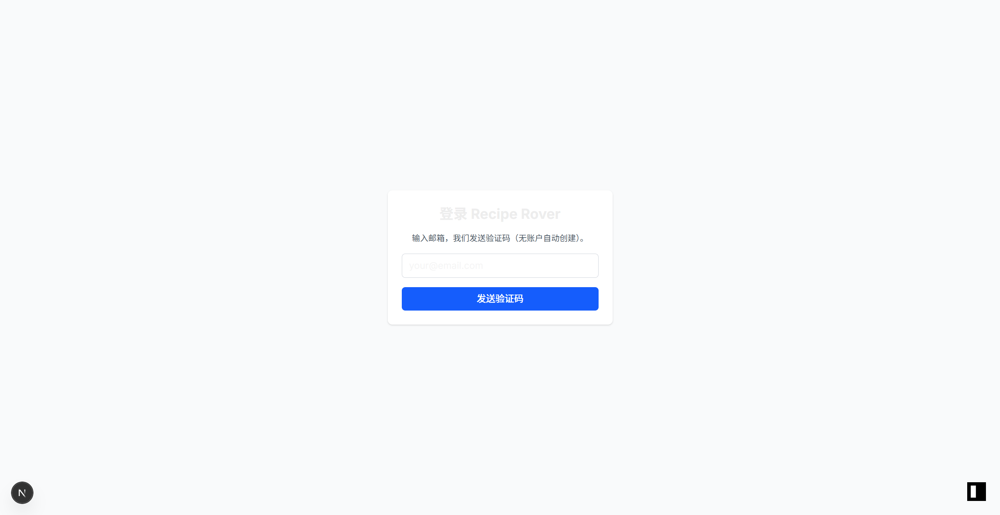

# 食旅星球 Recipe Rover 🌍🍳

**食旅星球 (Recipe Rover)** 是一款 AI 驱动的全球美食探索与烹饪辅助工具。它能根据你厨里现有的食材，通过先进的人工智能技术，为你量身定制全球各地的精选菜谱，让每一次下厨都成为一场味蕾的环球旅行。



## ✨ 核心特性

- **🚀 智能落地页**：极其现代的视觉设计，磨砂玻璃效果 (Glassmorphism) 与平滑动画，完美适配多端。
- **🤖 AI 驱动的灵感生成**：
  - 基于现有的食材点击即可生成。
  - 支持“手气不错”随机寻找灵感。
  - 接入 Google Gemini 2.5 系列模型，生成专业且易做的家常菜谱。
- **🔐 极简无感登录**：Magic Code 验证码登录，支持 6 位验证码自动提交，流程丝滑。
- **📸 视觉盛宴**：AI 自动为生成的菜谱匹配极具食欲的专业摄影级配图。
- **👤 个人设置中心**：
  - 支持个性化头像上传（集成 InstantDB Storage）。
  - 查看账户信息与多端同步。
- **💖 精选收藏夹**：一键收藏心仪食谱，打造属于你的私人米其林数据库。

## 🛠️ 技术栈

- **Frontend**: [Next.js 15](https://nextjs.org/) (App Router), [React 19](https://react.dev/), [Tailwind CSS 4](https://tailwindcss.com/)
- **Database & Storage**: [InstantDB](https://www.instantdb.com/) - 实时图数据库与存储
- **AI Models**: 
  - [Google Gemini 2.5 Flash](https://aistudio.google.com/) - 文本食谱生成
  - [Gemini-2.5-Flash-Image](https://aistudio.google.com/) - 菜谱配图生成
- **Icons**: [Lucide React](https://lucide.dev/), [Heroicons](https://heroicons.com/)

## 🚀 快速开始

### 1. 克隆项目

```bash
git clone https://github.com/phoenixlwpapix/recipe-rover.git
cd recipe-rover
```

### 2. 安装依赖

```bash
pnpm install
```

### 3. 环境配置

在根目录创建 `.env.local` 并填写以下配置：

```env
NEXT_PUBLIC_INSTANT_APP_ID=你的_INSTANT_APP_ID
GEMINI_API_KEY=你的_GOOGLE_AI_API_KEY
```

### 4. 运行开发服务器

```bash
pnpm dev
```

打开 [http://localhost:3000](http://localhost:3000) 即可开始探索。

## 📸 运行截图

*(待补充详细截图)*

## 📄 开源协议

本项目基于 MIT 协议开源。

---
Inspired by global flavors. Built with AI. 🥗✨
